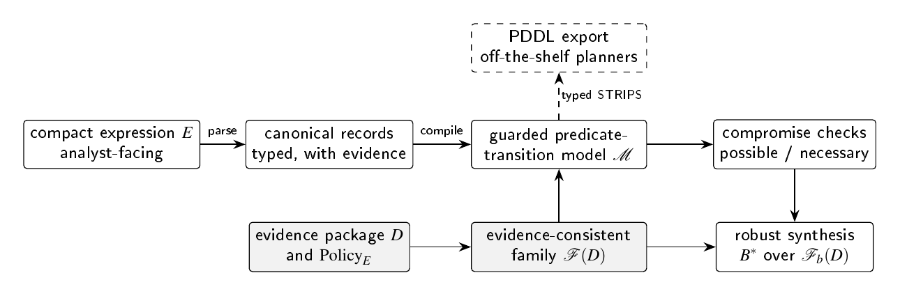
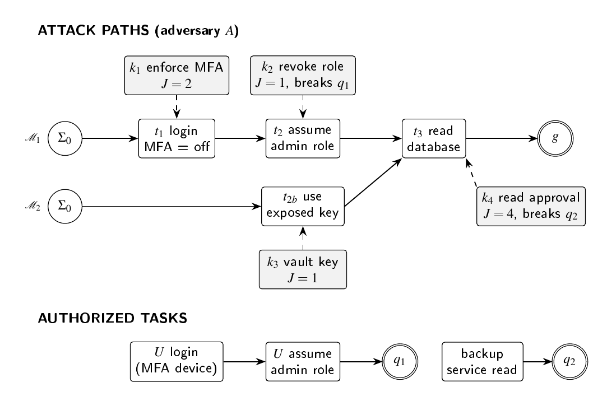
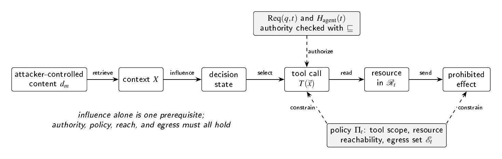

# Attack Calculus (ACN)

<!-- doi-badge --> [](https://creativecommons.org/licenses/by/4.0/) [](LICENSE) [](https://orcid.org/0009-0001-6573-385X)

**A Typed, Evidence-Aware State-Transition Calculus for Cross-Domain Cybersecurity Reasoning**

Thor Thor. Independent Open-Source Researcher, [THOR-SEC](https://codethor0.github.io/thor-sec/). ORCID: [0009-0001-6573-385X](https://orcid.org/0009-0001-6573-385X)

This research was conducted independently on the author's own time and is not sponsored by, affiliated with, or representative of any employer.

## Abstract

Cybersecurity frameworks classify adversary behavior, exchange threat intelligence, catalog defensive techniques, and generate attack graphs, yet incident reasoning still lacks a compact notation that states at once why an action occurs, how it occurs, which state enables it, which state it changes, and what evidence supports each claim. This paper proposes Attack Calculus Notation (ACN), a typed, evidence-aware state-transition calculus that connects analyst-readable incident reasoning to machine-checkable models. Each atomic action is an actor-labelled transition with explicit intent, mechanism, target, object, channel, valued guards, add and delete effects, and field-level evidence. Compact expressions denote finite trace languages and compile to a guarded predicate-transition model whose finite-ground reachability core reduces to typed STRIPS planning under stated invariant assumptions, which fixes the complexity of compromise checking. Evidence uncertainty defines a family of admissible models, over which ACN distinguishes possible from necessary compromise. Defensive controls are model transformations, and robust task-preserving synthesis selects the least-cost control bundle that eliminates every modeled prohibited outcome in every admissible model while keeping authorized-task utility above a floor in the worst admissible model. An AI-agent extension separates influence from authority and measures excess authority with a capability subsumption order. A complete worked example, reproduced by a published reference checker, shows a case where an analysis restricted to the most likely model selects a control that fails in an admissible alternative, and where attack-only minimization breaks a business task. The work is a formal specification and falsifiable research program; it claims no empirical superiority.

## At a glance

**The pipeline.** Analyst expressions compile to a guarded predicate-transition model, equivalent to typed STRIPS planning. Evidence decides which models are admissible, and every analysis quantifies over that family.



**The worked example.** A synthetic identity incident with two admissible explanations. Every value below is reproduced by `scripts/acn_checks.py`.



- Robust synthesis across both admissible models selects {k1, k3} at cost 3 and preserves every authorized task.
- Analyzing only the most direct reading of the evidence selects {k1} at cost 2, which leaves the second admissible attack path open.
- Attack-only minimization selects {k2, k3} at cost 2 and breaks a legitimate maintenance task.

**The AI-agent extension.** Influence is one prerequisite among several. Parameter-scoped authority, deterministic policy, resource reachability, and egress must all license a path to a prohibited effect.



## Status

This is a formal specification and a falsifiable research program. It reports no empirical results. Claims of improved accuracy, usability, or defensive effectiveness remain hypotheses until the evaluation program in Section 11 of the paper is carried out.

## Contents

| Path | Description |
|------|-------------|
| `paper/ACN.pdf` | The paper |
| `paper/acn.tex` | LaTeX source (single file, figures in TikZ) |
| `paper/abstract.txt` | Plain-text abstract |
| `scripts/acn_checks.py` | Reference checker; reproduces every value in the worked example |
| `docs/figures/` | Figures used in this README |
| `CHANGELOG.md` | Revision history |

## Running the reference checker

```
python3 scripts/acn_checks.py
```

Standard library only. The checker implements valued states, invariants, enablement, application, trace execution, independence, exact reachability, possible and necessary compromise, controls, robust synthesis, and subsumption-aware excess authority. It validates the paper's semantics and arithmetic; it does not measure real-world effectiveness.

## Building the paper

```
cd paper
pdflatex acn.tex
pdflatex acn.tex
```

## Review and feedback

Corrections, counterexamples, and implementations are welcome. Open an issue using the "Review finding" template and cite the section, equation, definition, or figure.

## Citation

<!-- doi-citation -->
Use the "Cite this repository" button on GitHub, or the metadata in `CITATION.cff`.

## Related work by the author

Thor, T. (2026). Mission-Invariant Architecture Morphing: Service-Graph Reconfiguration Against Post-Access Reconnaissance, with Cryptographic Epoch Isolation and Mission-Domain State Continuity (1.0.0). Zenodo. https://doi.org/10.5281/zenodo.23001045

## Licenses

- Paper text and figures (`paper/`, `docs/`): Creative Commons Attribution 4.0 International (CC BY 4.0).
- Code (`scripts/`): MIT License, see `LICENSE`.
